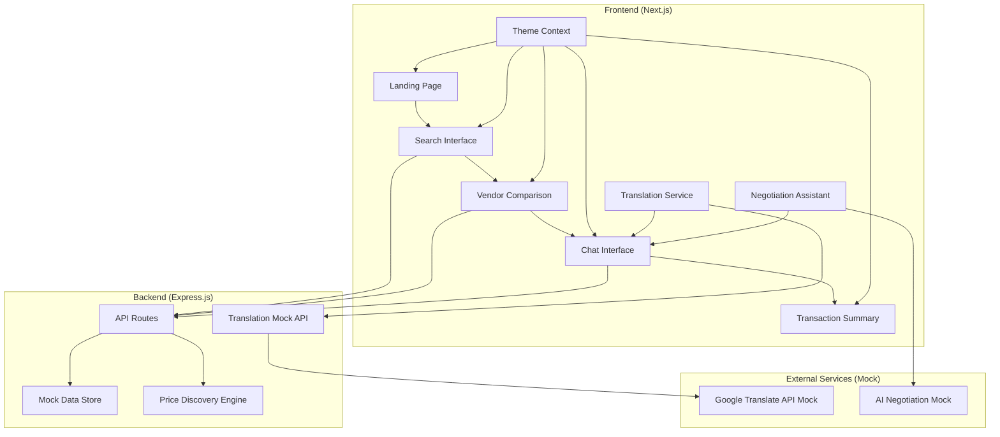

# Design Document

## Overview

The Multilingual Mandi is a Next.js-based web application that provides a bilingual marketplace interface for local trade in India. The system uses a modern React architecture with TypeScript, Tailwind CSS for styling, and Express.js for the backend API. The design prioritizes responsive mobile-first UI, real-time translation capabilities, and an intuitive user experience for the 48-hour hackathon demo.

The architecture follows a client-server model with mock data storage, translation simulation, and AI-powered negotiation assistance. The system is designed to be easily extensible for real API integrations while maintaining simplicity for the MVP demonstration.

## Architecture

### System Architecture



### Component Architecture

The frontend follows a component-based architecture with the following key components:

- **Layout Components**: Navbar, Footer, ThemeProvider
- **Page Components**: Home, Search, VendorDetail, Chat
- **UI Components**: SearchBar, VendorCard, ChatMessage, FloatingActionButton
- **Service Components**: TranslationService, NegotiationService
- **Context Providers**: ThemeContext, LanguageContext

### Technology Stack

- **Frontend**: Next.js 16, TypeScript, Tailwind CSS, React Context API
- **Backend**: Node.js, Express.js, CORS middleware
- **Styling**: Tailwind CSS with custom design system
- **State Management**: React Context and useState hooks
- **Data Storage**: In-memory JavaScript objects and localStorage
- **Translation**: Mock API simulating Google Translate
- **Build Tools**: Next.js built-in bundling and optimization

## Components and Interfaces

### Frontend Components

#### Core Page Components

**HomePage Component**
- Renders landing page with buyer/seller selection
- Implements hero section with call-to-action buttons
- Responsive design with mobile-first approach
- Integrates with theme context for dark mode

**SearchPage Component**
- Handles product search functionality
- Displays search results with vendor comparison
- Implements bilingual search with auto-translation
- Manages search state and results pagination

**VendorDetailPage Component**
- Shows individual vendor information and pricing
- Initiates chat interface for buyer-vendor communication
- Displays vendor ratings and product details
- Handles vendor selection and navigation to chat

**ChatPage Component**
- Implements real-time translation chat interface
- Manages message history and translation display
- Integrates AI negotiation assistance
- Handles deal completion and summary generation

#### UI Components

**SearchBar Component**
```typescript
interface SearchBarProps {
  onSearch: (query: string, language: 'en' | 'hi') => void;
  placeholder?: string;
  suggestions?: string[];
  loading?: boolean;
}
```

**VendorCard Component**
```typescript
interface VendorCardProps {
  vendor: {
    id: string;
    name: string;
    nameHindi: string;
    price: number;
    rating: number;
    location: string;
    image?: string;
  };
  onSelect: (vendorId: string) => void;
}
```

**ChatMessage Component**
```typescript
interface ChatMessageProps {
  message: {
    id: string;
    text: string;
    translatedText?: string;
    sender: 'buyer' | 'vendor';
    timestamp: Date;
    language: 'en' | 'hi';
  };
  showTranslation: boolean;
}
```

### Backend API Interfaces

#### API Endpoints

**Product Search API**
```typescript
GET /api/search?q={query}&lang={language}
Response: {
  products: Product[];
  vendors: Vendor[];
  translations: { [key: string]: string };
}
```

**Vendor Details API**
```typescript
GET /api/vendors/{id}
Response: {
  vendor: Vendor;
  products: Product[];
  pricing: PriceInfo[];
}
```

**Translation API**
```typescript
POST /api/translate
Body: {
  text: string;
  from: 'en' | 'hi';
  to: 'en' | 'hi';
}
Response: {
  originalText: string;
  translatedText: string;
  confidence: number;
}
```

**Negotiation Assistant API**
```typescript
POST /api/negotiate
Body: {
  currentPrice: number;
  productType: string;
  negotiationHistory: Message[];
}
Response: {
  suggestedCounterOffer: number;
  negotiationTips: string[];
  phrases: { en: string; hi: string }[];
}
```

### Service Interfaces

**Translation Service**
```typescript
interface TranslationService {
  translate(text: string, from: Language, to: Language): Promise<TranslationResult>;
  detectLanguage(text: string): Promise<Language>;
  getSupportedLanguages(): Language[];
}
```

**Negotiation Service**
```typescript
interface NegotiationService {
  generateCounterOffer(context: NegotiationContext): Promise<CounterOffer>;
  getNegotiationTips(productType: string, language: Language): Promise<string[]>;
  generatePolitePhrase(intent: string, language: Language): Promise<string>;
}
```

## Data Models

### Core Data Models

**Product Model**
```typescript
interface Product {
  id: string;
  name: string;
  nameHindi: string;
  category: string;
  categoryHindi: string;
  unit: string;
  unitHindi: string;
  image?: string;
  description?: string;
  descriptionHindi?: string;
}
```

**Vendor Model**
```typescript
interface Vendor {
  id: string;
  name: string;
  nameHindi: string;
  location: string;
  locationHindi: string;
  rating: number;
  totalReviews: number;
  specialties: string[];
  specialtiesHindi: string[];
  contactInfo: {
    phone?: string;
    whatsapp?: string;
  };
  isOnline: boolean;
  responseTime: string;
}
```

**Price Information Model**
```typescript
interface PriceInfo {
  vendorId: string;
  productId: string;
  price: number;
  unit: string;
  currency: 'INR';
  lastUpdated: Date;
  negotiable: boolean;
  minQuantity?: number;
  maxQuantity?: number;
  discounts?: {
    quantity: number;
    percentage: number;
  }[];
}
```

**Chat Message Model**
```typescript
interface ChatMessage {
  id: string;
  conversationId: string;
  senderId: string;
  senderType: 'buyer' | 'vendor';
  originalText: string;
  translatedText?: string;
  originalLanguage: 'en' | 'hi';
  timestamp: Date;
  messageType: 'text' | 'price_offer' | 'counter_offer' | 'deal_accepted';
  metadata?: {
    priceOffer?: number;
    productId?: string;
    negotiationStep?: number;
  };
}
```

**Negotiation Context Model**
```typescript
interface NegotiationContext {
  productId: string;
  vendorId: string;
  buyerId: string;
  currentPrice: number;
  marketPriceRange: {
    min: number;
    max: number;
    average: number;
  };
  negotiationHistory: ChatMessage[];
  buyerProfile: {
    experienceLevel: 'beginner' | 'intermediate' | 'expert';
    preferredLanguage: 'en' | 'hi';
  };
}
```

### Mock Data Structure

**Sample Products Data**
```typescript
const mockProducts: Product[] = [
  {
    id: 'tomato-001',
    name: 'Fresh Tomatoes',
    nameHindi: 'ताज़े टमाटर',
    category: 'Vegetables',
    categoryHindi: 'सब्जियां',
    unit: 'kg',
    unitHindi: 'किलो'
  },
  // Additional products...
];
```

**Sample Vendors Data**
```typescript
const mockVendors: Vendor[] = [
  {
    id: 'vendor-001',
    name: 'Raj Vegetables',
    nameHindi: 'राज सब्जी भंडार',
    location: 'Connaught Place, Delhi',
    locationHindi: 'कनॉट प्लेस, दिल्ली',
    rating: 4.5,
    totalReviews: 127,
    specialties: ['Fresh Vegetables', 'Organic Produce'],
    specialtiesHindi: ['ताज़ी सब्जियां', 'जैविक उत्पाद'],
    isOnline: true,
    responseTime: '< 5 minutes'
  },
  // Additional vendors...
];
```

## Correctness Properties

*A property is a characteristic or behavior that should hold true across all valid executions of a system—essentially, a formal statement about what the system should do. Properties serve as the bridge between human-readable specifications and machine-verifiable correctness guarantees.*

### Property 1: Bilingual Search Consistency
**Validates: Requirements 1.1, 1.2**

For any valid search query in English or Hindi, the system must return results that include both English and Hindi product names.

```typescript
property("bilingual search results", () => {
  forAll(searchQuery(), (query) => {
    const results = searchProducts(query);
    return results.every(product => 
      product.name && product.nameHindi && 
      product.name.length > 0 && product.nameHindi.length > 0
    );
  });
});
```

### Property 2: Price Range Validation
**Validates: Requirements 2.1, 2.2**

All vendor prices displayed for produce items must fall within the expected market range of ₹20-35 per kg.

```typescript
property("price range validation", () => {
  forAll(productSearch(), (searchResult) => {
    return searchResult.vendors.every(vendor => 
      vendor.price >= 20 && vendor.price <= 35 && 
      vendor.currency === 'INR'
    );
  });
});
```

### Property 3: Translation Bidirectionality
**Validates: Requirements 3.1, 3.2**

Translation between English and Hindi must be bidirectional and preserve meaning.

```typescript
property("translation bidirectionality", () => {
  forAll(englishText(), (text) => {
    const hindiTranslation = translate(text, 'en', 'hi');
    const backTranslation = translate(hindiTranslation, 'hi', 'en');
    return semanticSimilarity(text, backTranslation) > 0.8;
  });
});
```

### Property 4: Negotiation Counter-Offer Reasonableness
**Validates: Requirements 4.1, 4.2**

AI-generated counter-offers must be within reasonable negotiation bounds (5-15% below current price).

```typescript
property("reasonable counter offers", () => {
  forAll(priceNegotiation(), (negotiation) => {
    const counterOffer = generateCounterOffer(negotiation);
    const reductionPercentage = (negotiation.currentPrice - counterOffer.suggestedPrice) / negotiation.currentPrice;
    return reductionPercentage >= 0.05 && reductionPercentage <= 0.15;
  });
});
```

### Property 5: Theme Persistence
**Validates: Requirements 6.1, 6.2**

Theme preferences must persist across browser sessions and be applied consistently.

```typescript
property("theme persistence", () => {
  forAll(themePreference(), (theme) => {
    setTheme(theme);
    const savedTheme = getStoredTheme();
    refreshPage();
    const appliedTheme = getCurrentTheme();
    return savedTheme === theme && appliedTheme === theme;
  });
});
```

### Property 6: Mock Data Consistency
**Validates: Requirements 8.1**

Mock data must remain consistent across user sessions and API calls.

```typescript
property("mock data consistency", () => {
  forAll(apiEndpoint(), (endpoint) => {
    const firstCall = makeApiCall(endpoint);
    const secondCall = makeApiCall(endpoint);
    return deepEqual(firstCall.data, secondCall.data);
  });
});
```

### Property 7: API Response Format Validation
**Validates: Requirements 9.1**

All API responses must conform to the expected interface structure.

```typescript
property("api response format", () => {
  forAll(apiRequest(), (request) => {
    const response = makeApiCall(request);
    return validateResponseSchema(response, getExpectedSchema(request.endpoint));
  });
});
```

### Property 8: Vendor Information Completeness
**Validates: Requirements 2.3**

All vendor objects must contain required fields with valid data.

```typescript
property("vendor completeness", () => {
  forAll(vendorQuery(), (query) => {
    const vendors = getVendors(query);
    return vendors.every(vendor => 
      vendor.id && vendor.name && vendor.nameHindi && 
      vendor.location && vendor.price > 0 && 
      vendor.rating >= 0 && vendor.rating <= 5
    );
  });
});
```

## Database Schema

For the 48-hour hackathon MVP, the system uses in-memory data storage with JavaScript objects. This section defines the data structure that would be used if implementing with a real database.

### Products Table
```sql
CREATE TABLE products (
  id VARCHAR(50) PRIMARY KEY,
  name VARCHAR(100) NOT NULL,
  name_hindi VARCHAR(100) NOT NULL,
  category VARCHAR(50) NOT NULL,
  category_hindi VARCHAR(50) NOT NULL,
  unit VARCHAR(20) NOT NULL,
  unit_hindi VARCHAR(20) NOT NULL,
  description TEXT,
  description_hindi TEXT,
  image_url VARCHAR(255),
  created_at TIMESTAMP DEFAULT CURRENT_TIMESTAMP,
  updated_at TIMESTAMP DEFAULT CURRENT_TIMESTAMP ON UPDATE CURRENT_TIMESTAMP
);
```

### Vendors Table
```sql
CREATE TABLE vendors (
  id VARCHAR(50) PRIMARY KEY,
  name VARCHAR(100) NOT NULL,
  name_hindi VARCHAR(100) NOT NULL,
  location VARCHAR(200) NOT NULL,
  location_hindi VARCHAR(200) NOT NULL,
  phone VARCHAR(20),
  whatsapp VARCHAR(20),
  rating DECIMAL(2,1) DEFAULT 0.0,
  total_reviews INT DEFAULT 0,
  is_online BOOLEAN DEFAULT false,
  response_time VARCHAR(50),
  created_at TIMESTAMP DEFAULT CURRENT_TIMESTAMP,
  updated_at TIMESTAMP DEFAULT CURRENT_TIMESTAMP ON UPDATE CURRENT_TIMESTAMP
);
```

### Vendor_Products Table (Junction Table)
```sql
CREATE TABLE vendor_products (
  id VARCHAR(50) PRIMARY KEY,
  vendor_id VARCHAR(50) NOT NULL,
  product_id VARCHAR(50) NOT NULL,
  price DECIMAL(10,2) NOT NULL,
  currency VARCHAR(3) DEFAULT 'INR',
  is_negotiable BOOLEAN DEFAULT true,
  min_quantity INT DEFAULT 1,
  max_quantity INT,
  last_updated TIMESTAMP DEFAULT CURRENT_TIMESTAMP ON UPDATE CURRENT_TIMESTAMP,
  FOREIGN KEY (vendor_id) REFERENCES vendors(id),
  FOREIGN KEY (product_id) REFERENCES products(id),
  UNIQUE KEY unique_vendor_product (vendor_id, product_id)
);
```

### Chat_Sessions Table
```sql
CREATE TABLE chat_sessions (
  id VARCHAR(50) PRIMARY KEY,
  buyer_id VARCHAR(50),
  vendor_id VARCHAR(50) NOT NULL,
  product_id VARCHAR(50) NOT NULL,
  status ENUM('active', 'completed', 'cancelled') DEFAULT 'active',
  final_price DECIMAL(10,2),
  created_at TIMESTAMP DEFAULT CURRENT_TIMESTAMP,
  updated_at TIMESTAMP DEFAULT CURRENT_TIMESTAMP ON UPDATE CURRENT_TIMESTAMP,
  FOREIGN KEY (vendor_id) REFERENCES vendors(id),
  FOREIGN KEY (product_id) REFERENCES products(id)
);
```

### Chat_Messages Table
```sql
CREATE TABLE chat_messages (
  id VARCHAR(50) PRIMARY KEY,
  session_id VARCHAR(50) NOT NULL,
  sender_type ENUM('buyer', 'vendor') NOT NULL,
  original_text TEXT NOT NULL,
  translated_text TEXT,
  original_language ENUM('en', 'hi') NOT NULL,
  message_type ENUM('text', 'price_offer', 'counter_offer', 'deal_accepted') DEFAULT 'text',
  price_offer DECIMAL(10,2),
  created_at TIMESTAMP DEFAULT CURRENT_TIMESTAMP,
  FOREIGN KEY (session_id) REFERENCES chat_sessions(id)
);
```

## API Endpoints

### Product Search API

**GET /api/search**
```http
GET /api/search?query=tomato&lang=en
```

**Request Parameters:**
- `query` (string, required): Search term in English or Hindi
- `lang` (string, optional): Language preference ('en' or 'hi'), defaults to 'en'

**Response:**
```json
{
  "success": true,
  "data": {
    "products": [
      {
        "id": "tomato-001",
        "name": "Fresh Tomatoes",
        "nameHindi": "ताज़े टमाटर",
        "category": "Vegetables",
        "categoryHindi": "सब्जियां",
        "vendors": [
          {
            "id": "vendor-001",
            "name": "Raj Vegetables",
            "nameEn": "Raj Vegetables",
            "price": 25,
            "location": "Connaught Place",
            "rating": 4.5,
            "isOnline": true
          }
        ]
      }
    ],
    "totalResults": 1,
    "searchTime": "0.15s"
  }
}
```

### Vendor Details API

**GET /api/vendor/{id}**
```http
GET /api/vendor/vendor-001
```

**Response:**
```json
{
  "success": true,
  "data": {
    "id": "vendor-001",
    "name": "राज सब्जी भंडार",
    "nameEn": "Raj Vegetables",
    "location": "Connaught Place, Delhi",
    "locationHindi": "कनॉट प्लेस, दिल्ली",
    "phone": "+91-9876543210",
    "rating": 4.5,
    "totalReviews": 127,
    "isOnline": true,
    "responseTime": "< 5 minutes",
    "specialties": ["Fresh Vegetables", "Organic Produce"],
    "specialtiesHindi": ["ताज़ी सब्जियां", "जैविक उत्पाद"],
    "products": [
      {
        "id": "tomato-001",
        "name": "Fresh Tomatoes",
        "nameHindi": "ताज़े टमाटर",
        "price": 25,
        "unit": "kg",
        "isNegotiable": true
      }
    ]
  }
}
```

### Translation API

**POST /api/translate**
```http
POST /api/translate
Content-Type: application/json

{
  "text": "What is your best price?",
  "from": "en",
  "to": "hi"
}
```

**Response:**
```json
{
  "success": true,
  "data": {
    "originalText": "What is your best price?",
    "translatedText": "आपकी सबसे अच्छी कीमत क्या है?",
    "originalLanguage": "en",
    "targetLanguage": "hi",
    "confidence": 0.95
  }
}
```

### Chat Session API

**POST /api/chat/session**
```http
POST /api/chat/session
Content-Type: application/json

{
  "vendorId": "vendor-001",
  "productId": "tomato-001",
  "buyerId": "buyer-001"
}
```

**Response:**
```json
{
  "success": true,
  "data": {
    "sessionId": "session-001",
    "vendorId": "vendor-001",
    "productId": "tomato-001",
    "status": "active",
    "createdAt": "2024-01-26T10:30:00Z"
  }
}
```

### Send Message API

**POST /api/chat/message**
```http
POST /api/chat/message
Content-Type: application/json

{
  "sessionId": "session-001",
  "senderType": "buyer",
  "text": "What is your best price?",
  "language": "en"
}
```

**Response:**
```json
{
  "success": true,
  "data": {
    "messageId": "msg-001",
    "sessionId": "session-001",
    "originalText": "What is your best price?",
    "translatedText": "आपकी सबसे अच्छी कीमत क्या है?",
    "senderType": "buyer",
    "timestamp": "2024-01-26T10:31:00Z"
  }
}
```

### Negotiation Assistant API

**POST /api/negotiate**
```http
POST /api/negotiate
Content-Type: application/json

{
  "sessionId": "session-001",
  "currentPrice": 30,
  "productType": "vegetables",
  "negotiationHistory": [
    {
      "text": "My price is 30 rupees per kg",
      "senderType": "vendor"
    }
  ]
}
```

**Response:**
```json
{
  "success": true,
  "data": {
    "suggestedCounterOffer": 25,
    "negotiationTips": [
      "Ask about bulk discounts",
      "Mention you're a regular customer",
      "Be polite and respectful"
    ],
    "phrases": {
      "en": "Can you do 25 rupees per kg?",
      "hi": "क्या आप 25 रुपये प्रति किलो में दे सकते हैं?"
    },
    "reasoning": "Counter-offer is 16.7% below asking price, within reasonable negotiation range"
  }
}
```

### Error Response Format

All API endpoints return errors in a consistent format:

```json
{
  "success": false,
  "error": {
    "code": "VALIDATION_ERROR",
    "message": "Invalid search query",
    "details": {
      "field": "query",
      "reason": "Query cannot be empty"
    }
  }
}
```

**Common Error Codes:**
- `VALIDATION_ERROR`: Invalid request parameters
- `NOT_FOUND`: Requested resource not found
- `TRANSLATION_FAILED`: Translation service unavailable
- `RATE_LIMIT_EXCEEDED`: Too many requests
- `INTERNAL_ERROR`: Server error

## Responsive UI Structure

### Page Layout Structure

**Mobile (320px - 768px)**
```
┌─────────────────────┐
│      Navbar         │ ← Fixed header with hamburger menu
├─────────────────────┤
│                     │
│    Page Content     │ ← Full width, stacked layout
│    (Stacked)        │
│                     │
├─────────────────────┤
│  Floating Action    │ ← Bottom right corner
│      Button         │
└─────────────────────┘
```

**Tablet (768px - 1024px)**
```
┌─────────────────────────────────┐
│           Navbar                │ ← Fixed header with expanded menu
├─────────────────────────────────┤
│                                 │
│     Two-Column Layout           │ ← Sidebar + main content
│   ┌─────────┬─────────────────┐ │
│   │Sidebar  │  Main Content   │ │
│   │         │                 │ │
│   └─────────┴─────────────────┘ │
├─────────────────────────────────┤
│        Floating Action          │
└─────────────────────────────────┘
```

**Desktop (1024px+)**
```
┌─────────────────────────────────────────┐
│              Navbar                     │ ← Fixed header with full menu
├─────────────────────────────────────────┤
│                                         │
│        Three-Column Layout              │
│ ┌─────────┬─────────────┬─────────────┐ │
│ │Sidebar  │Main Content │ Chat Panel  │ │
│ │         │             │             │ │
│ │         │             │             │ │
│ └─────────┴─────────────┴─────────────┘ │
├─────────────────────────────────────────┤
│           Floating Action               │
└─────────────────────────────────────────┘
```

### Component Hierarchy

```
App
├── ThemeProvider
├── Navbar
│   ├── Logo
│   ├── NavigationMenu
│   ├── DarkModeToggle
│   └── MobileMenuButton
├── Main Content
│   ├── HomePage
│   │   ├── HeroSection
│   │   ├── FeatureCards
│   │   └── StatsSection
│   ├── SearchPage
│   │   ├── SearchBar
│   │   ├── SearchSuggestions
│   │   ├── ProductResults
│   │   └── VendorCards
│   ├── VendorDetailPage
│   │   ├── VendorHeader
│   │   ├── ProductInfo
│   │   ├── PriceInfo
│   │   └── ContactButton
│   └── ChatPage
│       ├── ChatHeader
│       ├── MessageList
│       ├── MessageInput
│       ├── QuickReplies
│       ├── TranslationToggle
│       ├── NegotiationAssistant
│       └── DealSummary
└── FloatingActionButton
```

### Breakpoint Strategy

```css
/* Mobile First Approach */
.container {
  /* Base styles for mobile */
  padding: 1rem;
  
  /* Tablet styles */
  @media (min-width: 768px) {
    padding: 2rem;
    display: grid;
    grid-template-columns: 250px 1fr;
  }
  
  /* Desktop styles */
  @media (min-width: 1024px) {
    padding: 3rem;
    grid-template-columns: 250px 1fr 300px;
  }
  
  /* Large desktop styles */
  @media (min-width: 1440px) {
    max-width: 1400px;
    margin: 0 auto;
  }
}
```

This completes the comprehensive design document for the Multilingual Mandi hackathon MVP, covering all architectural decisions, data models, API specifications, and responsive design considerations needed for the 48-hour development sprint.